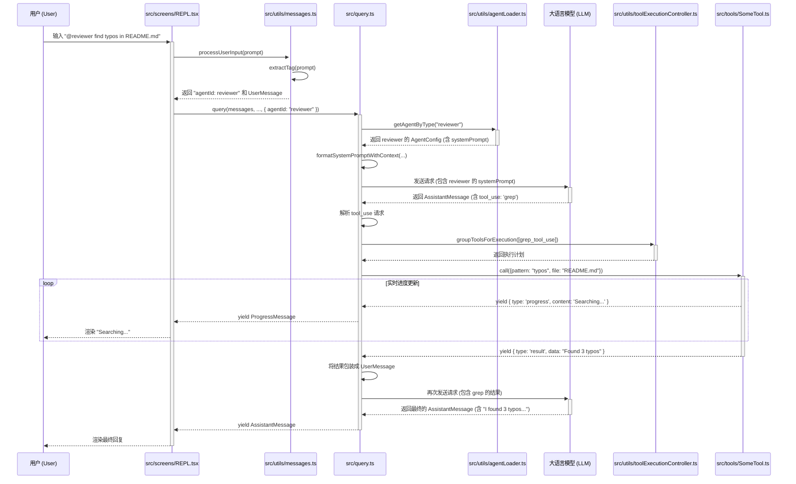

```mermaid
sequenceDiagram
    participant U as 用户 (User)
    participant REPL as src/screens/REPL.tsx
    participant MSG_UTIL as src/utils/messages.ts
    participant QUERY as src/query.ts
    participant AGENT_LOADER as src/utils/agentLoader.ts
    participant LLM as 大语言模型 (LLM)
    participant TEC as src/utils/toolExecutionController.ts
    participant TOOL as src/tools/SomeTool.ts

    U->>+REPL: 输入 "@reviewer find typos in README.md"
    REPL->>+MSG_UTIL: processUserInput(prompt)
    MSG_UTIL->>MSG_UTIL: extractTag(prompt)
    MSG_UTIL-->>REPL: 返回 "agentId: reviewer" 和 UserMessage
    REPL->>+QUERY: query(messages, ..., { agentId: "reviewer" })
    QUERY->>+AGENT_LOADER: getAgentByType("reviewer")
    AGENT_LOADER-->>-QUERY: 返回 reviewer 的 AgentConfig (含 systemPrompt)
    QUERY->>QUERY: formatSystemPromptWithContext(...)
    QUERY->>+LLM: 发送请求 (包含 reviewer 的 systemPrompt)
    LLM-->>-QUERY: 返回 AssistantMessage (含 tool_use: 'grep')
    QUERY->>QUERY: 解析 tool_use 请求
    QUERY->>+TEC: groupToolsForExecution([grep_tool_use])
    TEC-->>-QUERY: 返回执行计划
    QUERY->>+TOOL: call({pattern: "typos", file: "README.md"})

    loop 实时进度更新
        TOOL-->>QUERY: yield { type: 'progress', content: 'Searching...' }
        QUERY-->>REPL: yield ProgressMessage
        REPL-->>U: 渲染 "Searching..."
    end

    TOOL-->>-QUERY: yield { type: 'result', data: "Found 3 typos" }
    QUERY->>QUERY: 将结果包装成 UserMessage
    QUERY->>+LLM: 再次发送请求 (包含 grep 的结果)
    LLM-->>-QUERY: 返回最终的 AssistantMessage (含 "I found 3 typos...")
    QUERY-->>-REPL: yield AssistantMessage
    REPL-->>-U: 渲染最终回复
```
